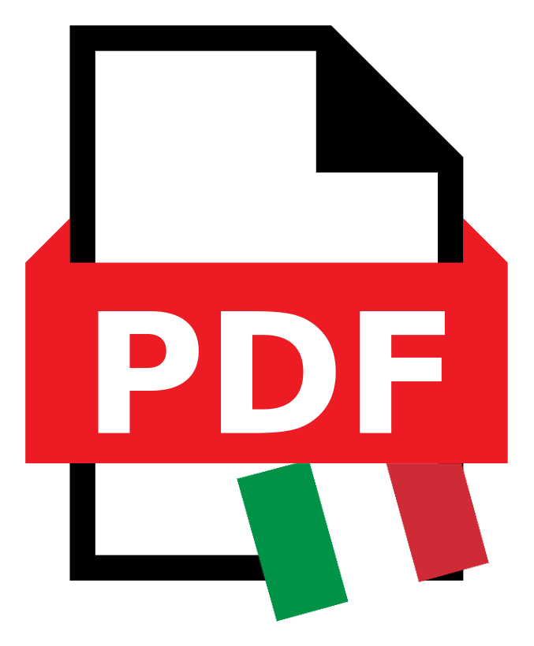

On this page, you can download my CV in both Italian and English. Please note that some contact details have been omitted in this publicly accessible version.

	

		

			
		

		

			
		

	

   <a href="/" role="button" class="btn btn-secondary mt-3">Back to Home</a>

